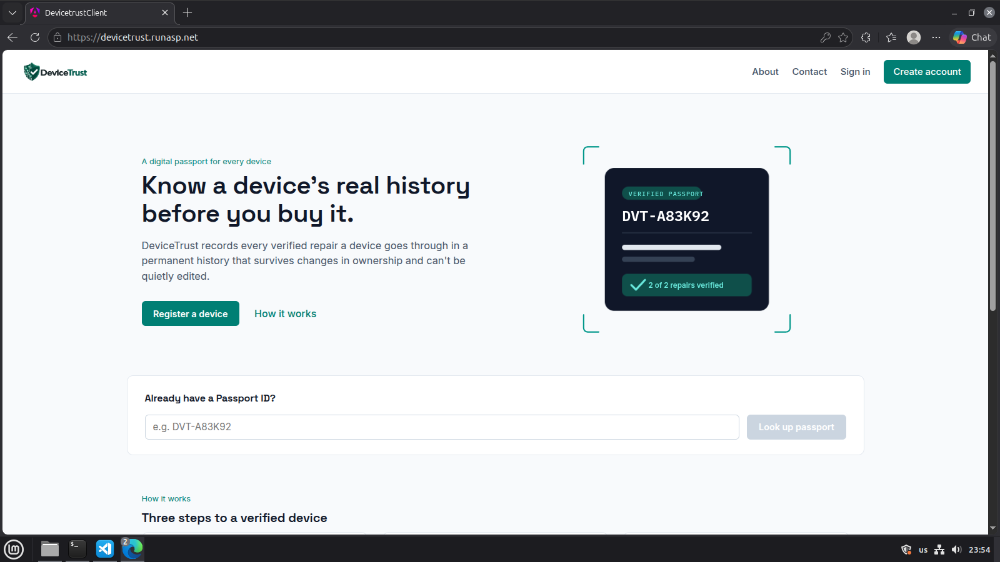
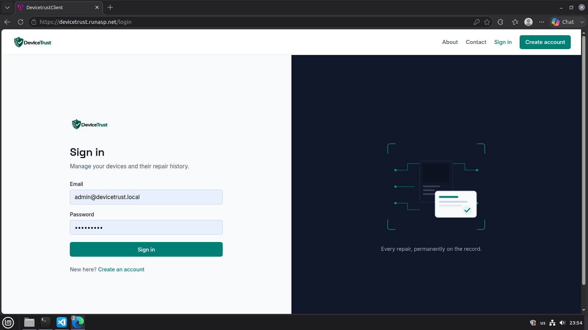
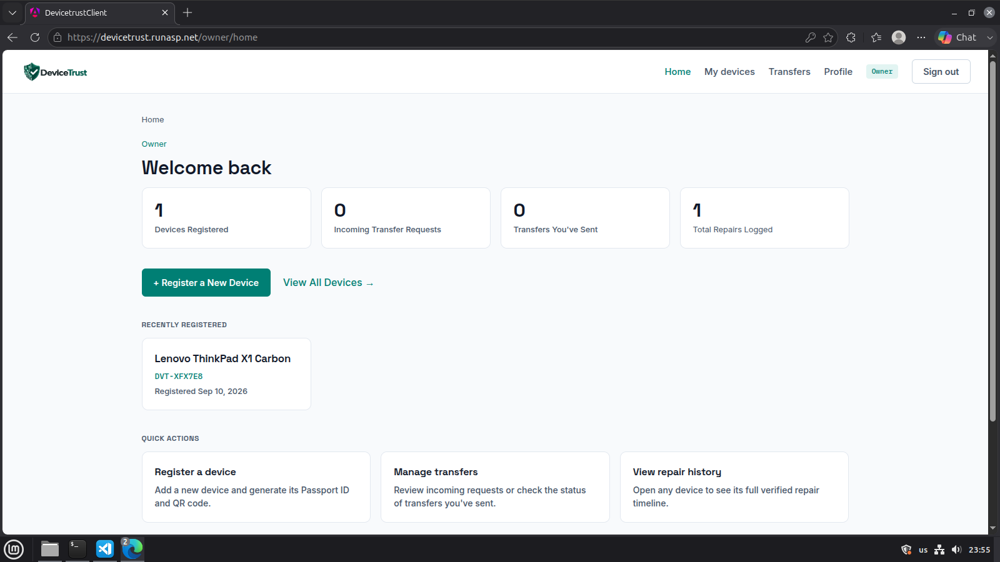
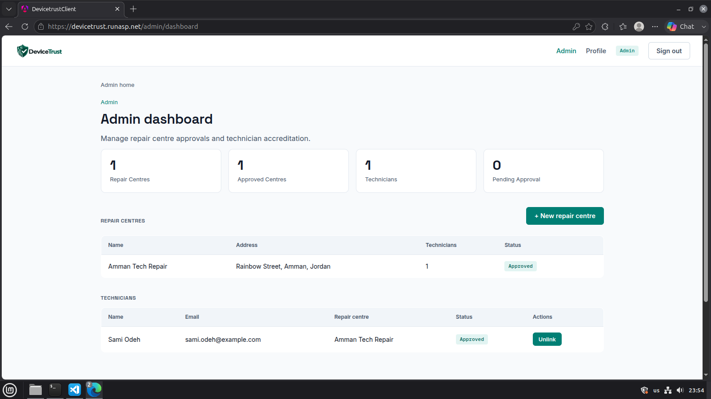
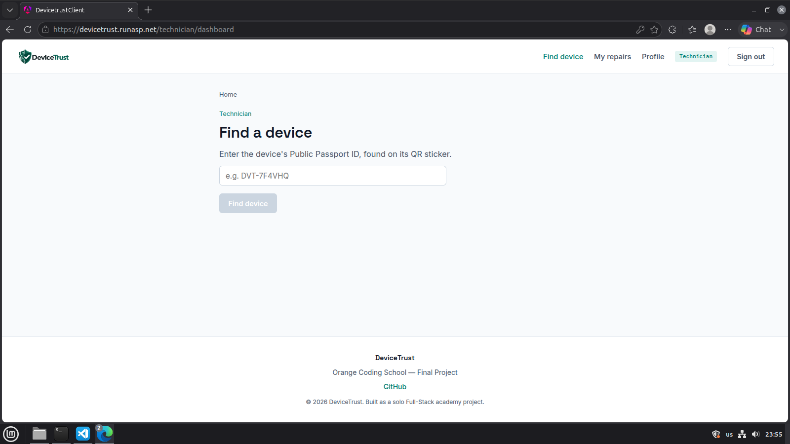

# DeviceTrust — Digital Lifecycle & Repair Passport for Electronic Devices

A Full-Stack Orange Coding Academy final project — an ASP.NET Core + Angular application that gives electronic devices a permanent, verifiable digital passport tracking their repair and ownership history.

**Live site:** [https://devicetrust.runasp.net](https://devicetrust.runasp.net)

## Table of Contents

- [Problem](#problem)
- [Solution](#solution)
- [Screenshots](#screenshots)
- [What DeviceTrust Is Not](#what-devicetrust-is-not)
- [Target Users & Roles](#target-users--roles)
- [Page Inventory](#page-inventory)
- [Core Features](#core-features)
- [Core Workflow](#core-workflow)
- [Architecture](#architecture)
- [Tech Stack](#tech-stack)
- [Database Design](#database-design)
- [Key Business Rules](#key-business-rules)
- [API Overview](#api-overview)
- [Security Considerations](#security-considerations)
- [Deployment](#deployment)
- [Setup Instructions (Local Development)](#setup-instructions-local-development)
- [Demo Accounts](#demo-accounts)
- [Testing](#testing)
- [Known Limitations](#known-limitations)
- [Future Improvements](#future-improvements)
- [Design & Product Documents](#design--product-documents)

---

## Problem

When someone buys a used laptop, phone, or other electronic device, they have no trustworthy way to verify its real technical history. Was the screen replaced? Was the battery swapped with a non-original part? Has it been water-damaged? Was a past repair even done by someone qualified? Sellers can claim anything, and buyers have no way to check.

## Solution

DeviceTrust gives every registered device a permanent **Digital Passport** — a public, verifiable record of its repair and ownership history that survives changes in ownership and cannot be quietly edited once verified. A technician logs a repair; once submitted, it becomes part of the device's permanent history. Anyone — no account required — can scan the device's QR code or look up its Passport ID to see that history before buying it.

Think of it as a Carfax for electronics, or a medical record that follows the device rather than its current owner.

## Screenshots

**Landing page** — problem statement, live passport lookup, and a walkthrough of how the system works.


**Login** — split layout with an animated illustration; the same pattern mirrors on Register.


**Owner Dashboard** — live stats, recently registered devices, and quick actions.


**Admin Dashboard** — repair centre and technician approval, with computed stats.


**Technician — Find a Device** — looking up a device by its Public Passport ID before logging a repair.


## What DeviceTrust Is Not

- **Not a marketplace or e-commerce platform** — no listings, no payments, no in-app buying/selling
- **Not a repair-shop management system** — it doesn't handle scheduling, invoicing, or parts inventory
- **Not blockchain-based** — trust is enforced through backend authorization, an append-only verification workflow, database constraints, and audit logging, not a distributed ledger. This was a deliberate scope decision (see [Known Limitations](#known-limitations))

## Target Users & Roles

| Role | Can do |
|---|---|
| **Owner** | Register devices, view ownership history, generate/download a device's QR code, initiate and manage ownership transfers, view a personal dashboard of activity |
| **Technician** | Once linked to an approved Repair Center and approved individually, can look up a device by its Public Passport ID, create and submit repair records, view their own repair history |
| **Repair Center** | An organizational entity technicians belong to; must be Admin-approved before its technicians' repairs count as trusted |
| **Public Visitor / Buyer** | No account needed — can look up any device's Public Passport by ID or QR scan and see its verified repair and ownership summary |
| **Admin** | Approves Repair Centers, links and approves Technicians, views system audit logs |

## Page Inventory

17 routed screens across all roles:

**Public:** Landing, About, Contact, Login, Register, Public Passport (`/passport/:id`)
**Owner:** Home/Dashboard, My Devices, Add Device, Device Detail, Transfers (Pending + History)
**Technician:** Find Device, My Repairs, Create Repair, Repair Detail
**Admin:** Admin Dashboard
**Shared:** Profile, Unauthorized (403), Not Found (404)

## Core Features

- **Authentication & Authorization** — JWT-based auth, role-based access control, server-side role validation (a user can never self-register as Admin)
- **Owner Dashboard** — a real landing-after-login page with live stats (device count, pending/sent transfers, total repairs) and quick actions, not just a raw list
- **Device Registration** — creates a device plus its initial ownership record atomically; generates a unique Public Passport ID separate from the internal database ID
- **Ownership History** — every device's detail page shows its full chain of past and current owners (dates only — no personal information about past owners is exposed, even to the current owner)
- **Digital Passport & QR Code** — a public, unauthenticated page per device showing masked serial number, repair timeline, and verified-vs-total repair counts as a trust signal; a QR code generated client-side that a user can print and attach to the physical device (so it survives even if the device's own screen is damaged)
- **Repair Records** — technicians log diagnosis, action taken, and replaced parts; a repair is auto-verified on submission if the technician and their repair center are both approved (re-checked at the moment of submission, not just when drafted); once verified, a record cannot be edited or deleted — corrections require creating a new record linked to the original
- **Technician "My Repairs"** — a list view of every repair a technician has personally submitted
- **Ownership Transfer** — a real multi-step workflow: the current owner initiates a transfer to a specific registered buyer by email, the buyer accepts or rejects it, and acceptance atomically closes the old ownership record and opens a new one inside a single database transaction. A History tab shows past resolved transfers on both sides (seller/buyer)
- **Repair Center / Technician Approval** — Admin-gated onboarding; technicians self-register but start unlinked and unapproved, and their repairs are not trusted until an Admin links them to an approved Repair Center and approves them individually
- **Admin Dashboard** — live computed stats (approved/pending centers and technicians) alongside management tables
- **Profile Page** — every authenticated role can view their own account details
- **Audit Logging** — sensitive actions (e.g. repair verification) are recorded with who performed them and when

## Core Workflow

```
Owner registers a device
        ↓
Device + initial Ownership created (Public Passport ID generated)
        ↓
Owner downloads/prints the QR code and attaches it to the device
        ↓
Device needs a repair
        ↓
Technician scans the QR / enters the Passport ID
        ↓
Technician creates a repair record (diagnosis, action, parts)
        ↓
Technician submits it — trust rule re-checked, auto-verified if approved
        ↓
Repair becomes permanent, immutable history
        ↓
Owner later decides to sell the device
        ↓
Owner initiates an Ownership Transfer to the buyer's email
        ↓
Buyer accepts — ownership atomically moves, repair history stays attached
        ↓
Anyone can scan the device's QR and see its full verified history
```

## Architecture

The backend uses a pragmatic 3-project split rather than full Clean Architecture:

```
DeviceTrust.Api             → Controllers, DTOs, JWT/auth setup, Program.cs
DeviceTrust.Infrastructure  → DbContext, EF Core configuration, service implementations, migrations
DeviceTrust.Domain          → Entities, enums — no external dependencies
DeviceTrust.Tests           → xUnit unit tests against Infrastructure services
```

Dependency direction: `Api → Infrastructure → Domain`, never backwards. `Domain` has zero framework dependencies — it doesn't know it's being persisted by EF Core or served over HTTP.

This was a deliberate choice over a 4-layer Clean Architecture split: for a solo MVP, the extra indirection of a dedicated Application layer with repository interfaces didn't pay for itself. The 3-project split still enforces correct dependency direction and separation of concerns without ceremony.

The Angular front-end mirrors the backend's module boundaries under `features/` (`auth`, `landing`, `about`, `contact`, `devices`, `passport`, `transfers`, `repairs`, `admin`, `profile`), with shared singletons (`AuthService`, an HTTP interceptor that auto-attaches the JWT, and route guards) under `core/`.

**Production deployment note:** the deployed app serves the Angular build as static files directly from the ASP.NET Core API's `wwwroot` folder — one deployable, one domain, no CORS needed in production. See [Deployment](#deployment).

## Tech Stack

**Backend:** ASP.NET Core Web API (.NET 10), Entity Framework Core, SQL Server, ASP.NET Core Identity, JWT Bearer authentication, xUnit + EF Core InMemory for testing

**Frontend:** Angular (standalone components, signals), Reactive Forms, `qrcode` for client-side QR generation, custom inline SVG illustrations (no external image dependencies)

**Hosting:** [MonsterASP.NET](https://www.monsterasp.net) — free-tier ASP.NET Core + SQL Server hosting

**Tooling:** Git/GitHub, Postman (manual API testing), Swagger/Swashbuckle (API exploration)

## Database Design

Ten core entities: `ApplicationUser` (ASP.NET Identity), `Device`, `Ownership`, `OwnershipTransfer`, `RepairCenter`, `TechnicianProfile`, `RepairRecord`, `RepairPart`, `Attachment`, `AuditLog`.

Notable design decisions:
- **`Ownership` is a history table**, not a single `Device.CurrentOwnerId` field — a filtered unique index (`WHERE EndDate IS NULL`) guarantees exactly one active owner per device at the database level, while all past ownerships remain queryable and are surfaced in the UI.
- **`OwnershipTransfer` has its own status workflow** (`Pending / Accepted / Rejected / Cancelled / Expired`) rather than being a fire-and-forget action — a filtered unique index similarly guarantees at most one pending transfer per device at a time.
- **`RepairRecord.CorrectsRecordId`** is a self-referencing nullable foreign key — corrections to a verified repair are new rows that point back at the original, so history is never overwritten.
- **`AuditLog` uses a polymorphic `EntityType` + `EntityId` pair** rather than a strict foreign key — an accepted tradeoff scoped to this one table.

Full ERD and DBML schema: [`docs/schema.dbml`](docs/schema.dbml), [`docs/erd.png`](docs/erd.png).

## Key Business Rules

Full list with rationale: [`docs/business-rules.md`](docs/business-rules.md). Highlights:

1. A device has exactly one current owner at all times (DB-enforced via filtered unique index).
2. Only the current owner can initiate a transfer; only the named target buyer can accept or reject it — both checks happen inside the query itself, not as an after-the-fetch check.
3. Accepting a transfer is wrapped in a database transaction: closing the old ownership, opening the new one, and updating the transfer's status either all succeed or all roll back together.
4. A repair is only trusted (auto-verified on submit) if its technician is linked to an approved Repair Center **and** is individually approved — re-checked at submit time, not just when the draft was created.
5. A verified repair record cannot be edited or deleted. Corrections are new records linked to the original via `CorrectsRecordId`.
6. The Public Passport never exposes owner name, email, phone, address, or the full serial number.
7. Ownership history is visible to the current owner, but past owners' identities are never exposed — only dates.
8. A Public Passport ID is a separate, randomly generated identifier from the internal database ID.
9. A user can only self-register as `Owner` or `Technician` — the `Admin` role is never assignable through the public registration endpoint, regardless of what the client sends.

## API Overview

Full endpoint list and design rationale: [`docs/api-design.md`](docs/api-design.md).

Representative endpoints:

```
POST   /api/auth/register
POST   /api/auth/login

GET    /api/devices
GET    /api/devices/summary
POST   /api/devices
GET    /api/devices/{id}
GET    /api/passports/{publicId}              ← public, no auth

POST   /api/devices/{id}/transfers
GET    /api/transfers/pending
GET    /api/transfers/history
POST   /api/transfers/{id}/accept
POST   /api/transfers/{id}/reject
POST   /api/transfers/{id}/cancel

POST   /api/devices/{id}/repairs
GET    /api/technicians/repairs
POST   /api/repairs/{id}/parts
POST   /api/repairs/{id}/submit
GET    /api/repairs/{id}

GET    /api/technicians/devices/lookup/{publicId}   ← Technician-only device lookup by Passport ID

POST   /api/repaircenters
POST   /api/repaircenters/{id}/approve
POST   /api/technicians/{id}/link
POST   /api/technicians/{id}/approve

GET    /api/profile
GET    /api/admin/audit-logs
```

Interactive API docs available via Swagger at `/swagger` when running the API in development mode.

## Security Considerations

- **JWT-based authentication** with role claims (`Owner`, `Technician`, `Admin`); `[Authorize(Roles = "...")]` enforced on every non-public controller/action.
- **Resource-level authorization is enforced inside service-layer queries**, not just at the controller's role-check level — e.g. `GET /api/devices/{id}` filters `deviceId + callerId` together in a single query, so a device that exists but belongs to someone else returns `404`, not `403`.
- **Public vs. private DTOs are always separate classes**, never one shared DTO with fields conditionally nulled out based on caller.
- **Server-side role validation on registration** — the `Admin` role can never be granted through self-registration.
- **Secrets are never committed to source control** — local development uses `dotnet user-secrets`; production uses MonsterASP's environment-variable configuration panel (connection string, JWT signing key, seed Admin credentials).
- **Race-condition protection on Ownership Transfers**: a service-level pre-check gives a clean error message, but the actual guarantee is a database-level filtered unique index.

## Deployment

The live site (`https://devicetrust.runasp.net`) runs on MonsterASP.NET's free ASP.NET Core + SQL Server tier. Deployment builds the Angular app in production configuration and copies its output into the API project's own `wwwroot` folder before publishing, so the ASP.NET Core app serves both the API and the compiled front-end from a single process — no separate frontend host, no CORS configuration needed between them.

Deploy process:
1. `ng build --configuration production` (Angular)
2. `dotnet publish -c Release` (API), with the Angular build copied into its `wwwroot`
3. The publish output is zipped and uploaded via MonsterASP's file manager, then extracted directly into the site's web root with an automatic application-pool restart

## Setup Instructions (Local Development)

### Prerequisites
- .NET 10 SDK
- Node.js + Angular CLI (`npm install -g @angular/cli`)
- SQL Server (LocalDB, Express, or full instance)

### Backend

```bash
cd DeviceTrust/DeviceTrust.Api

dotnet user-secrets init
dotnet user-secrets set "ConnectionStrings:DeviceTrustDb" "Server=<your-server>;Database=DeviceTrustDb;Trusted_Connection=True;TrustServerCertificate=True"
dotnet user-secrets set "Jwt:Key" "<a long random string, 32+ characters>"
dotnet user-secrets set "Jwt:Issuer" "DeviceTrust"
dotnet user-secrets set "Jwt:Audience" "DeviceTrustClient"
dotnet user-secrets set "SeedAdmin:Email" "admin@devicetrust.local"
dotnet user-secrets set "SeedAdmin:Password" "<a strong password>"

dotnet ef database update --project ../DeviceTrust.Infrastructure --startup-project . --context DeviceTrustDbContext

dotnet run
```

The API seeds the `Admin`/`Owner`/`Technician` roles and the Admin account on first run.

### Frontend

```bash
cd devicetrust-client
npm install
ng serve
```

Update `src/environments/environment.ts` if your API runs on a different port than `http://localhost:5270`.

Open `http://localhost:4200`.

## Demo Accounts

| Role | Notes |
|---|---|
| Admin | Credentials set via `SeedAdmin:Email` / `SeedAdmin:Password` in user-secrets (local) or environment variables (production) |
| Owner | Self-register via `/register`, choosing "Device Owner" |
| Technician | Self-register via `/register`, choosing "Technician" — then an Admin must link them to an approved Repair Center and approve them before they can submit trusted repairs |

## Testing

Backend unit tests (xUnit + EF Core InMemory) cover the highest-risk business logic:

```bash
cd DeviceTrust
dotnet test DeviceTrust.Tests
```

Covered scenarios:
- A device cannot have two simultaneous pending ownership transfers
- A transfer cannot target an email that isn't a registered user
- Accepting a transfer atomically closes the old ownership and opens the new one
- A repair cannot be created/submitted if the technician or their repair center isn't approved
- Trust is re-checked at submission time, not just when the draft was created
- A verified repair record cannot be edited

All other endpoints and workflows were manually verified end-to-end via Postman (backend) and through the live Angular UI (full stack), including cross-user authorization checks and the complete demo flow (register → repair → verify → transfer → public passport) on the live deployment.

Note: EF Core's InMemory provider doesn't enforce database-level constraints (unique indexes) or support real transactions, so the true database-enforced race-condition guard on Ownership Transfers was validated separately against a real SQL Server instance rather than in the unit test suite.

## Known Limitations

- **Attachments (photo/invoice upload)** were deferred — not required for the core demo story and would have added meaningful scope without changing the trust model itself.
- **No blockchain** — by design. Trust and immutability are enforced through backend authorization, database constraints, and an append-only correction model, not a distributed ledger.
- **No email verification or password reset flow.**
- **Ownership transfer requires the buyer to already have a DeviceTrust account** — a deliberate MVP simplification.
- **No automated peer-review verification step** — repairs are auto-verified on submission if the trust rule passes.
- **Device search on the Technician dashboard is exact-match by Public Passport ID only.**
- **Contact form is UI-only** — it doesn't currently send to a real inbox or backend endpoint.

## Future Improvements

- Attachment upload (before/after photos, invoices, inspection reports)
- Email notifications (transfer requests, repair verification)
- A trust score computed from a device's full history, surfaced on the Public Passport
- Peer-review verification workflow for repairs
- Component-level tracking across repairs
- Wire the Contact form to a real inbox

## Design & Product Documents

- [Business Model Canvas](docs/business-model-canvas.md)
- [Business Rules](docs/business-rules.md)
- [API Design](docs/api-design.md)
- [Database Schema (DBML)](docs/schema.dbml) / [ERD](docs/erd.png)
- [Presentation Deck](docs/DeviceTrust-Presentation.pptx)
